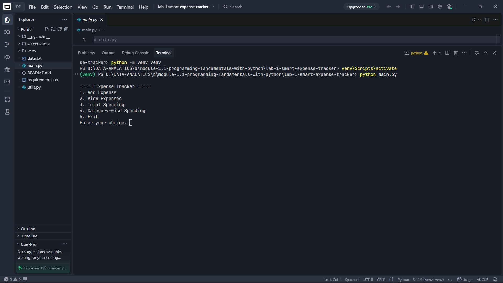
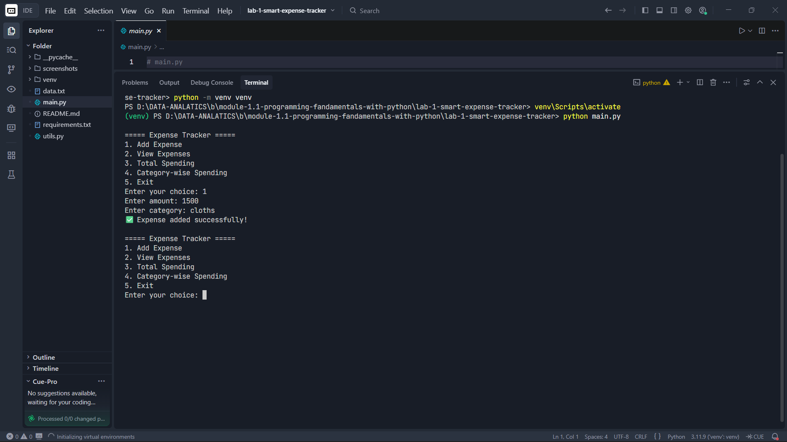
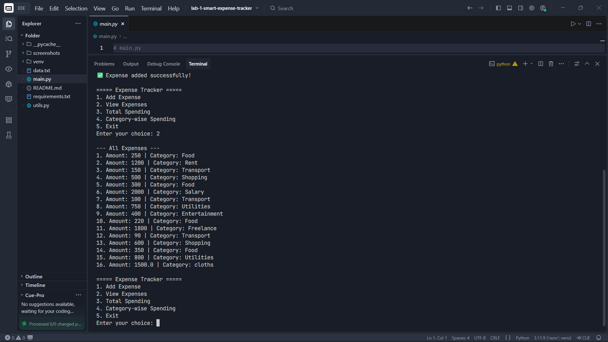
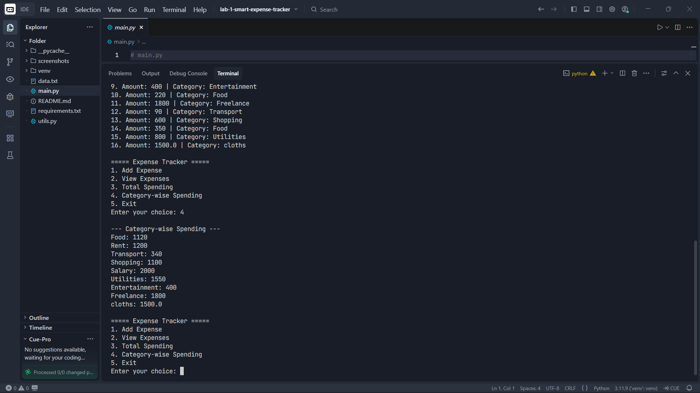

# 📊 Smart Expense Tracker (CLI)

## 🚀 Project Overview

The **Smart Expense Tracker** is a Command Line Interface (CLI) application built using Python.

It helps users:

* Track daily expenses
* Categorize spending
* Analyze total and category-wise expenses
* Store data persistently using file handling

---

## 🎯 Objective

Build a system that:

* Accepts user input
* Stores structured data
* Performs basic analysis
* Demonstrates core Python fundamentals

---

## 🧠 Concepts Applied

This project applies **Python Fundamentals (Module 1)**:

* Variables & Data Types
* Lists & Dictionaries
* Loops (for, while)
* Conditional Statements
* Functions (modular code)
* File Handling (JSON storage)
* Error Handling (try/except)

---

## 📂 Project Structure

```
expense_tracker/
 ┣ main.py          # CLI interaction (user interface)
 ┣ utils.py         # Core logic (functions)
 ┣ data.txt         # Data storage (JSON format)
 ┗ requirements.txt # Dependencies
```

---

## ⚙️ Features

✔ Add Expense
✔ View All Expenses
✔ Calculate Total Spending
✔ Category-wise Spending
✔ Persistent Storage (file-based)

---

## 📦 Environment Setup

### 1. Clone the Repository

```bash
git clone <your-repo-link>
cd expense_tracker
```

---

### 2. Create Virtual Environment (Recommended)

```bash
python -m venv venv
```

---

### 3. Activate Virtual Environment

#### Windows:

```bash
venv\Scripts\activate
```

#### Mac/Linux:

```bash
source venv/bin/activate
```

---

### 4. Install Requirements

```bash
pip install -r requirements.txt
```

> Note: No external libraries are required.

---

## ▶️ How to Run

```bash
python main.py
```

---

## 📄 Sample Data (data.txt)

```json
[
    {"amount": 250, "category": "Food"},
    {"amount": 1200, "category": "Rent"},
    {"amount": 150, "category": "Transport"}
]
```

---

## 🖥️ Example Output

```
===== Expense Tracker =====
1. Add Expense
2. View Expenses
3. Total Spending
4. Category-wise Spending
5. Exit
```

---

## 📸 Execution Proof (Screenshots)

> Added real screenshots after running  project     

### 🔹 Menu Screen



### 🔹 Adding Expense



### 🔹 View Expenses



### 🔹 Category-wise Spending



---

## 🔥 Real-World Learning Outcomes

* Structured data handling
* CLI-based application design
* Modular programming
* Data persistence using files
* Analytical thinking

---

## 🚀 Future Improvements

* Add date tracking
* Separate income vs expense
* Export to CSV
* Monthly reports
* Simple dashboard (next level)

---

## 💡 Key Takeaway

> This project builds the foundation for real-world data applications
> and prepares you for advanced tools like Pandas and Data Analysis.

---

## 👨‍💻 Author

**Prthmesh Joshi**

---

## ⭐ Support

If you liked it, give it a ⭐ and keep building!
