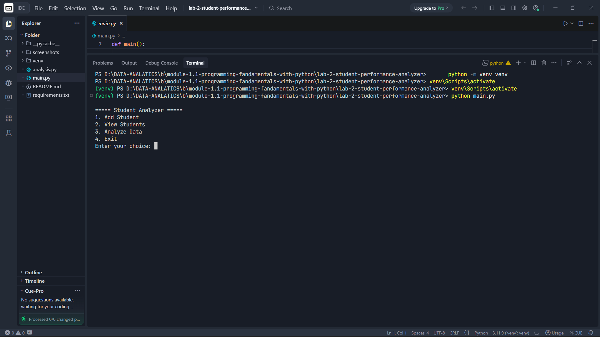
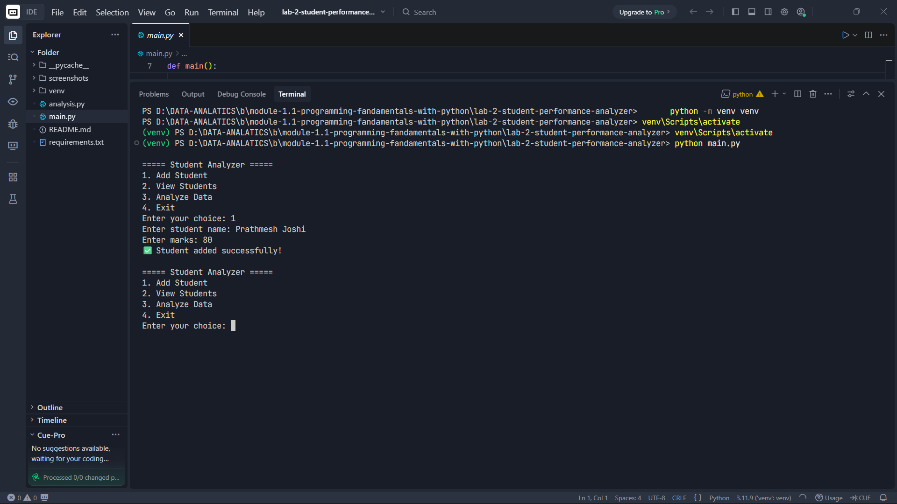
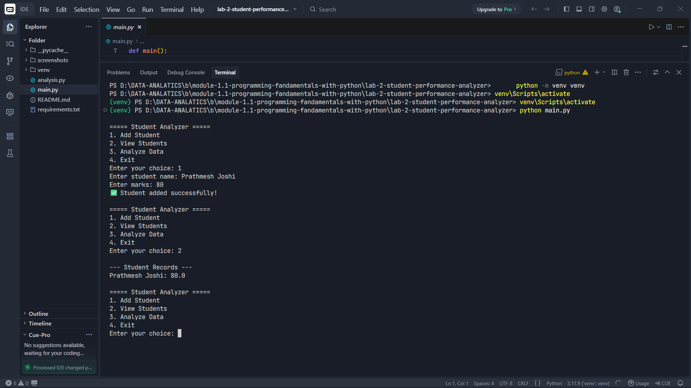
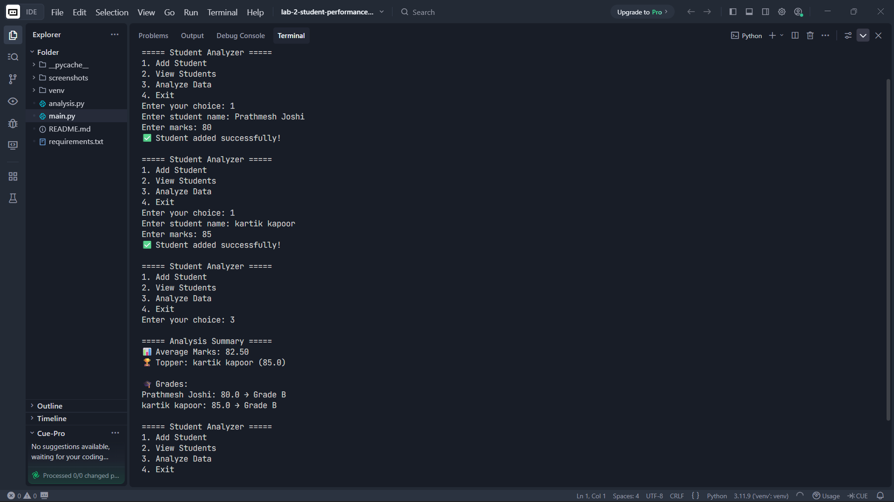

# 🎓 Student Performance Analyzer (CLI)

## 🚀 Project Overview

The **Student Performance Analyzer** is a Command Line Interface (CLI) application built using Python.

It helps users:

* Store student marks
* Analyze performance
* Identify top performers
* Generate insights like average and grades

---

## 🎯 Objective

Build a system that:

* Accepts student data
* Performs basic statistical analysis
* Converts raw data into meaningful insights
* Demonstrates Python fundamentals in a real-world scenario

---

## 🧠 Concepts Applied

This project applies **Python Fundamentals (Module 1)**:

* Variables & Data Types
* Dictionaries (data storage)
* Loops (for iteration)
* Conditional Statements (grading logic)
* Functions (modular design)
* Basic Statistics (average, max)
* Error Handling (try/except)

---

## 📂 Project Structure

```
student_analyzer/
 ┣ main.py          # CLI interaction (user interface)
 ┣ analysis.py      # Core logic (analysis functions)
 ┗ requirements.txt # Dependencies
```

---

## ⚙️ Features

✔ Add Student Data
✔ View Student Records
✔ Calculate Average Marks
✔ Find Topper
✔ Assign Grades
✔ Generate Summary Report

---

## 📦 Environment Setup

### 1. Clone the Repository

```bash
git clone <your-repo-link>
cd student_analyzer
```

---

### 2. Create Virtual Environment (Recommended)

```bash
python -m venv venv
```

---

### 3. Activate Virtual Environment

#### Windows:

```bash
venv\Scripts\activate
```

#### Mac/Linux:

```bash
source venv/bin/activate
```

---

### 4. Install Requirements

```bash
pip install -r requirements.txt
```

> Note: No external libraries are required.

---

## ▶️ How to Run

```bash
python main.py
```

---

## 🧪 Sample Usage

```
===== Student Analyzer =====
1. Add Student
2. View Students
3. Analyze Data
4. Exit
```

---

## 📊 Example Analysis Output

```
===== Analysis Summary =====

📊 Average Marks: 81.67
🏆 Topper: C (90)

🎓 Grades:
A: 85 → Grade B
B: 70 → Grade C
C: 90 → Grade A
```

---

## 📸 Execution Proof (Screenshots)

> Added real screenshots after running  project 

### 🔹 Menu Screen



### 🔹 Adding Student Data



### 🔹 View Students



### 🔹 Analysis Output



---

## 🔥 Real-World Learning Outcomes

* Data storage using dictionaries
* Writing analytical logic
* Converting data into insights
* Designing CLI-based tools
* Thinking like a data analyst

---

## 🚀 Future Improvements

* Add file saving (persist data)
* Add pass/fail classification
* Add lowest scorer detection
* Add grade distribution chart
* Export results to CSV

---

## 💡 Key Takeaway

> This project demonstrates how raw data (marks) can be transformed
> into meaningful insights (average, grades, topper).

---

## 👨‍💻 Author

**Prathmesh Joshi**

---

## ⭐ Support

If this lab helped and you liked it, give it a ⭐ and keep building!
