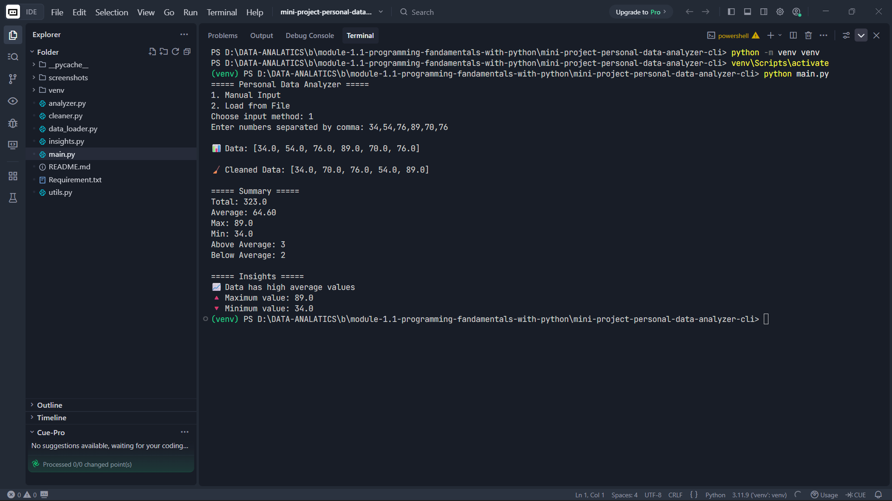

# 📊 Personal Data Analyzer CLI

## 🚀 Project Overview

The **Personal Data Analyzer CLI** is a Python-based command-line application that allows users to:

* Input numerical data (manual or file)
* Clean and validate data
* Perform statistical analysis
* Generate meaningful insights

This project is built using **pure Python (Module 1 concepts only)** and focuses on developing an **analytical mindset and modular programming skills**.

---

## 🎯 Objectives

* Build end-to-end data processing pipeline
* Practice modular coding structure
* Apply real-world data thinking
* Prepare for advanced tools like Pandas

---

## 🧠 Features

### 1. Data Input

* Manual input (comma-separated values)
* File input (line-by-line values)

### 2. Data Cleaning

* Removes duplicate values
* Skips invalid inputs

### 3. Data Analysis

* Total
* Average
* Minimum & Maximum
* Distribution analysis

### 4. Insights Generation

* Detects high/low trends
* Identifies variation in data
* Flags possible outliers

### 5. Output

* Displays clean summary
* Prints insights clearly

---

## 📂 Project Structure

```
data_analyzer/
│
├── main.py            # Entry point (controls workflow)
├── data_loader.py     # Handles user/file input
├── cleaner.py         # Data cleaning logic
├── analyzer.py        # Statistical calculations
├── insights.py        # Insight generation logic
├── utils.py           # Helper functions
├── requirements.txt   # Dependencies
└── README.md          # Project documentation
```

---

## ⚙️ Requirements

* Python 3.x
* No external libraries required

---

## 🛠️ Environment Setup

### Step 1: Clone the Repository

```
git clone <your-repo-link>
cd data_analyzer
```

### Step 2: Create Virtual Environment (Recommended)

#### On Windows:

```
python -m venv venv
venv\Scripts\activate
```

#### On Mac/Linux:

```
python3 -m venv venv
source venv/bin/activate
```

### Step 3: Install Dependencies

```
pip install -r requirements.txt
```

(Note: No external dependencies are required for this project)

---

## ▶️ How to Run the Project

```
python main.py
```

---

## 💻 Example Usage

### Manual Input:

```
Enter numbers separated by comma: 10, 20, 30, 100
```

### File Input:

```
Enter file path: data.txt
```

---

## 📸 Execution Proof (Screenshots)

> Added real screenshots after running  project 

### Example:

#### 🔹 Input-Output & Insights Display



---

## 🧠 Learning Outcomes

* Understand data flow (Input → Processing → Output)
* Apply data cleaning techniques
* Perform basic statistical analysis
* Develop analytical thinking
* Write modular and reusable code

---

## ⚠️ Important Note

This project is designed for **learning**, not just execution.

👉 Don’t just run it —

* Modify it
* Break it
* Improve it

That’s how real growth happens.

---

## 🚀 Future Improvements

* Add median calculation
* Add sorting functionality
* Save results to file
* Improve outlier detection
* Upgrade to Pandas-based version

---

## 👨‍💻 Author

**Prathmesh Joshi**

---

## ⭐ Support

If you liked it, give it a ⭐ and keep building!

