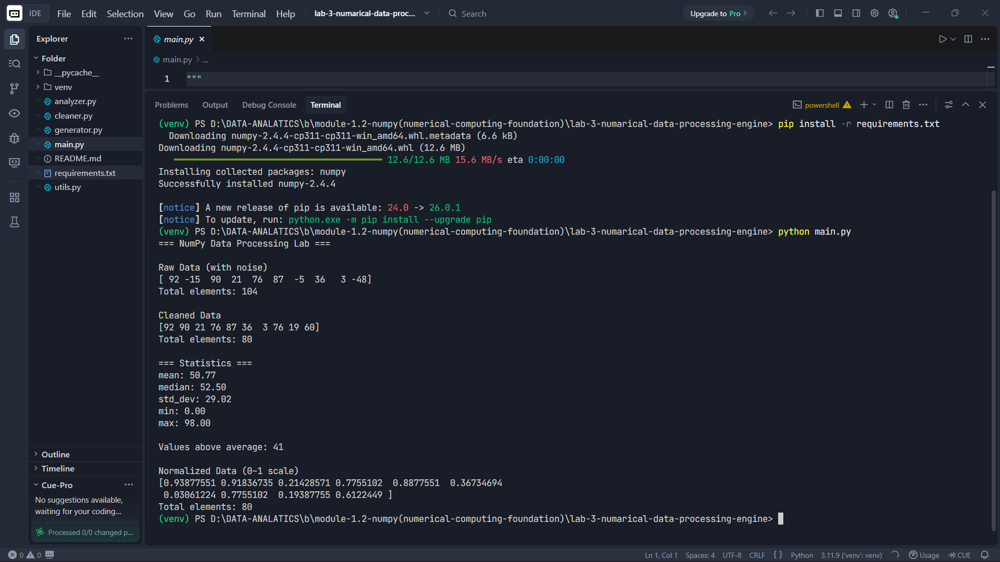

# 🧪 NumPy Numerical Data Processing Lab

## 🚀 Project Overview

This project is a **NumPy-based data processing system** that simulates real-world numerical data workflows.

It performs:

* Data generation (with noise)
* Data cleaning using vectorized operations
* Statistical analysis
* Data normalization

Built using **NumPy (Module 2 concepts only)**, this lab focuses on developing:

👉 Vectorized thinking
👉 Efficient data processing
👉 Real-world data cleaning logic

---

## 🎯 Objectives

* Work with NumPy arrays
* Apply boolean masking for filtering
* Perform statistical analysis
* Understand normalization techniques
* Build modular and efficient code

---

## 🧠 Features

### 1. Data Generation

* Random dataset (50–100 values)
* Includes:

  * Negative values (noise)
  * Outliers (extreme values)

### 2. Data Cleaning

* Removes negative values
* Removes outliers (threshold-based filtering)

### 3. Data Analysis

* Mean
* Median
* Standard Deviation
* Minimum & Maximum

### 4. Advanced Processing

* Count values above average
* Normalize data (0–1 scaling)

---

## 📂 Project Structure

```bash
lab_numpy_processing/
│
├── main.py          # Entry point (workflow controller)
├── generator.py     # Generates noisy dataset
├── cleaner.py       # Data cleaning using NumPy
├── analyzer.py      # Statistical analysis
├── utils.py         # Helper functions
├── requirements.txt # Dependencies
└── README.md        # Documentation
```

---

## ⚙️ Requirements

* Python 3.x
* NumPy

---

## 🛠️ Environment Setup

### Step 1: Create Virtual Environment (Recommended)

#### 🔹 Windows

```bash
python -m venv venv
venv\Scripts\activate
```

#### 🔹 Mac/Linux

```bash
python3 -m venv venv
source venv/bin/activate
```

---

### Step 2: Install Dependencies

```bash
pip install -r requirements.txt
```

---

## ▶️ How to Run

```bash
python main.py
```

---

## 💻 Sample Output (Example)

```bash
=== NumPy Data Processing Lab ===

Raw Data (with noise)
[ 23  45 -12 200  67 ...]

Cleaned Data
[23 45 67 ...]

=== Statistics ===
mean: 45.23
median: 44.00
std_dev: 12.11
min: 10.00
max: 89.00

Values above average: 18

Normalized Data (0–1 scale)
[0.12 0.45 0.78 ...]
```

---

## 📸 Execution Proof (Screenshots)

> Added real screenshots after running  project

 🔹 Raw Data Output
 🔹 Cleaned Data & Statistics
 🔹 Normalized Data Output



---

## 🧠 Learning Outcomes

* Efficient numerical computation using NumPy
* Data cleaning using boolean masking
* Vectorized operations for performance
* Statistical analysis on arrays
* Real-world data pipeline thinking

---

## ⚠️ Important Note

This project is for **learning by doing**.

👉 Don’t just run it
👉 Modify the logic
👉 Experiment with different data

That’s how you build real skills.

---

## 🚀 Future Improvements

* Add sorting (`np.sort`)
* Add percentile calculation (`np.percentile`)
* Implement Z-score based outlier detection
* Add visualization (Matplotlib)

---

## 👨‍💻 Author

**Prathmesh Joshi**

---

## ⭐ Support

If you liked it, give it a ⭐ and keep building!
