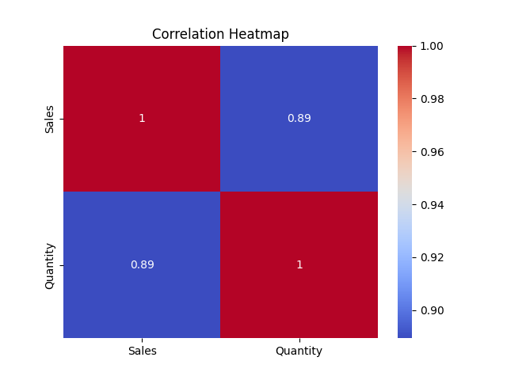
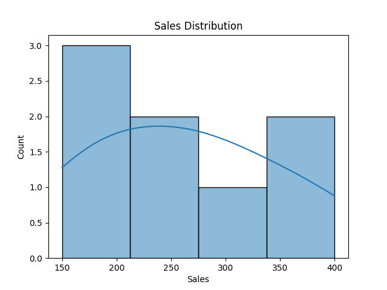
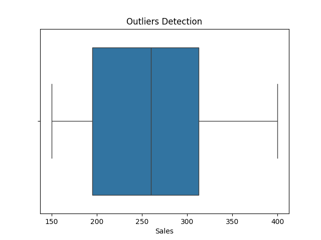
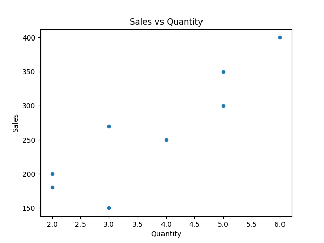
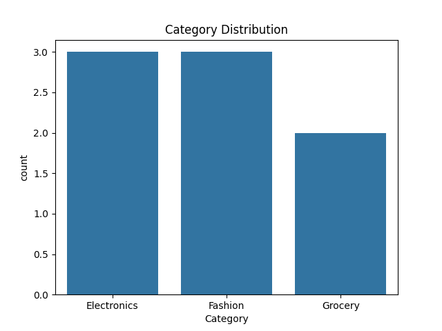

# 🚀 EDA Insights Engine

## 📊 Overview

The **EDA Insights Engine** is a Python-based system that performs complete **Exploratory Data Analysis (EDA)** on a dataset.

It automates:

* Data cleaning
* Statistical analysis
* Relationship detection
* Visualization generation
* Insight reporting

👉 This project focuses on **data understanding + storytelling**, which is a core skill for data analysts.

---

## 🎯 Objective

Build a system that:

* Understands dataset structure
* Identifies patterns and relationships
* Detects anomalies and outliers
* Generates visual insights
* Produces an automated analysis report

---

## 🧠 Concepts Used

* Pandas (data analysis & manipulation)
* Seaborn (advanced visualization)
* Matplotlib (plot control)
* Correlation analysis
* Distribution analysis
* Outlier detection (IQR method)
* Data cleaning techniques

---

## 📂 Project Structure

```id="s9d4k2"
eda_insights_engine/
│
├── main.py              # Main pipeline
├── loader.py            # Load dataset
├── cleaner.py           # Clean data
├── analyzer.py          # EDA logic
├── visualizer.py        # Plot generation
├── report.py            # Report generator
├── utils.py             # Helper functions
│
├── data/
│   └── dataset.csv      # Input dataset
│
├── outputs/
│   ├── plots/           # Saved visualizations
│   └── report.txt       # Generated report
│
├── requirements.txt
└── README.md
```

---

## ⚙️ Environment Setup

### 1️⃣ Clone Repository

```bash id="a2k8l1"
git clone https://github.com/your-username/eda_insights_engine.git
cd eda_insights_engine
```

---

### 2️⃣ Create Virtual Environment

```bash id="p7d3r5"
python -m venv venv
```

---

### 3️⃣ Activate Environment

#### ▶ Windows:

```bash id="x4c9n2"
venv\Scripts\activate
```

#### ▶ Mac/Linux:

```bash id="m6f2k8"
source venv/bin/activate
```

---

### 4️⃣ Install Dependencies

```bash id="z9v1q3"
pip install -r requirements.txt
```

---

## ▶️ How to Run

```bash id="l2h7p9"
python main.py
```

---

## 📊 Features

### 🔹 Data Cleaning

* Removes duplicate records
* Handles missing values

---

### 🔹 Analysis

* Dataset size and structure
* Summary statistics
* Missing value detection
* Correlation matrix
* Category insights
* Outlier detection (IQR method)

---

### 🔹 Visualizations

The system generates:

* 📊 Heatmap → Correlation between variables
* 📈 Histogram → Distribution analysis
* 📦 Boxplot → Outlier detection
* 🔵 Scatter Plot → Feature relationships
* 📊 Count Plot → Category distribution

---

### 🔹 Output

All results are saved automatically:

```id="k8s2d1"
outputs/
├── plots/
│   ├── heatmap.png
│   ├── distribution.png
│   ├── boxplot.png
│   ├── scatter.png
│   └── countplot.png
│
└── report.txt
```

---

## 📸 Execution Proof (Screenshots)

> Add screenshots after running the project

.png)

---

### 📌 Correlation Heatmap



---

### 📌 Distribution Plot



---

### 📌 Boxplot (Outliers)



---

### 📌 Scatter Plot



---

### 📌 Category Count Plot



---

## 🧪 Dataset Description

| Column   | Description          |
| -------- | -------------------- |
| Date     | Transaction date     |
| Category | Product category     |
| Sales    | Revenue generated    |
| Quantity | Number of items sold |

---

## 🔍 Key Insights (Example)

* Strong correlation may exist between **Sales and Quantity**
* Distribution may be **skewed**, indicating uneven sales patterns
* Outliers may represent **high-value transactions**
* Certain categories dominate in frequency and performance

---

## 💥 Skills Demonstrated

* End-to-end EDA workflow
* Data cleaning & preprocessing
* Statistical analysis
* Data visualization & storytelling
* Automated report generation
* Modular project architecture

---

## ⚠️ Future Improvements

* Add interactive dashboards (Streamlit)
* Use real-world large datasets
* Add advanced statistical testing
* Export reports in PDF format

---

## 🙌 Author

**Prathmesh Joshi**

---

## ⭐ Support

If this this helped and you liked it, please consider giving it a ⭐ keep building!

---
